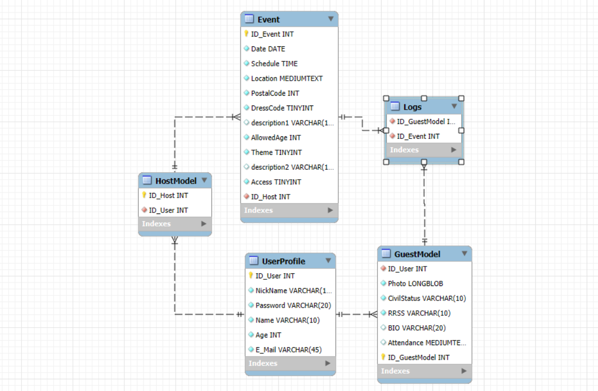
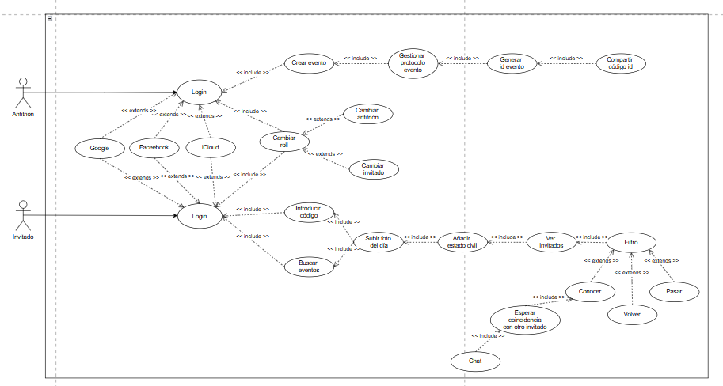

# 📱 Making Social!

> **¡Sin barreras, sin despistes, sin vergüenza!**

Making Social es una red social centrada en eventos que te ayuda a reconectar con personas que conociste en celebraciones, reuniones y encuentros sociales, incluso cuando no tuviste la oportunidad de hablar con ellas en el momento.  
¡Recupera esas conexiones que no deberían haberse perdido!

---

## 🌟 Introducción

¿Has asistido a una boda, una fiesta del pueblo, una cena de empresa o un cumpleaños y…?

- ¿Te llamó la atención alguien pero no te atreviste a acercarte?
- ¿Pasaste un buen rato con alguien y se te olvidó pedirle contacto?

Con **Making Social** esto dejará de pasarte.  
> *"Making Social, sin barreras, sin despistes, sin vergüenza."*

---

## 🧠 ¿Cómo funciona?

### 👤 Registro e inicio de sesión

Los **usuarios deben registrarse** con sus datos básicos para poder usar la plataforma.

---

## 🎉 Crear o buscar eventos

### 🏗️ Crear evento

- Cualquier usuario puede crear un evento (público o privado).
- Se genera un **código único** de acceso al evento.
- Se deben definir detalles como:
  - Lugar del evento
  - Fecha y hora de inicio
  - Edad permitida
  - ¿Hay dress code?
  - ¿Hay una temática?
  - Tipo (público o privado)

### 🔎 Buscar evento

- Los usuarios pueden buscar eventos disponibles:
  - **Públicos:** accesibles desde la app por código postal.
  - **Privados:** accesibles solo mediante el **código único** proporcionado por el anfitrión.

---

## ⏳ Acceso controlado al evento

- Los invitados **no podrán acceder al evento** dentro de la app **hasta 30 minutos antes de que comience**.
- Esto garantiza privacidad, orden y precisión en el registro de participantes. **¡Además de permitirte disfrutar de tu evento sin móvil!**

---

## 🙋 Participación como invitado

Para participar en un evento, el invitado debe proporcionar:

### ✅ Datos de identificación:

- Nombre visible.
- Edad (sólo mayores de 18 años).
- Foto de perfil tipo "ángulo americano", del día del evento.

### 🔒 Datos personales (privados hasta que haya coincidencia):

- Estado civil e intención en el evento (hacer amigos, aventura, relación).
- Tu nick name de Instagram para ser contactado.

---

## ⏱️ Después del evento

Pasadas **24 horas desde la hora de inicio del evento**, se activa la función de interacción social:

### 🎯 Interacciones disponibles:

- ✅ **Conocer**: Mostrar interés en alguien.
- ❌ **Pasar**: No estás interesado.
- 🔁 **Volver**: Volver a perfiles anteriores.

> Si **dos personas se eligen mutuamente como “Conocer”**, se desbloquean sus datos personales y formas de contacto.

---

## 🔗 Repositorio

Puedes consultar todo el proyecto aquí:  
[📁 GitHub - Making Social](https://github.com/varelaiglesiascarmen/Making-social)  

---

## ⚙️ Tecnologías usadas

- **Lenguaje:** Java (Swing)
- **Base de datos:** MySQL + JDBC
- **Arquitectura:** Modelo Vista Controlador (MVC)
- **Control de versiones:** Git + GitHub
- **Diseño UX:** Centrado en el diseño de interacción

---

## 📊 Diagramas del proyecto

- **Base de datos**

- **Casos de uso** 

---

## 👥 Equipo

Este proyecto ha sido desarrollado por estudiantes del ciclo de **Desarrollo de Aplicaciones Web** (@zhou950-1 y @varelaiglesiascarmen), con enfoque en:

- Prototipo de conceptos de nuevas RRSS

---

## 🤝 ¿Cómo colaborar?

¿Tienes ideas para mejorar Making Social?  
¡Nos encantaría contar contigo! Puedes:

- Abrir un [Issue](https://github.com/varelaiglesiascarmen/Making-social/issues/new) con sugerencias
- Compartir feedback directamente
